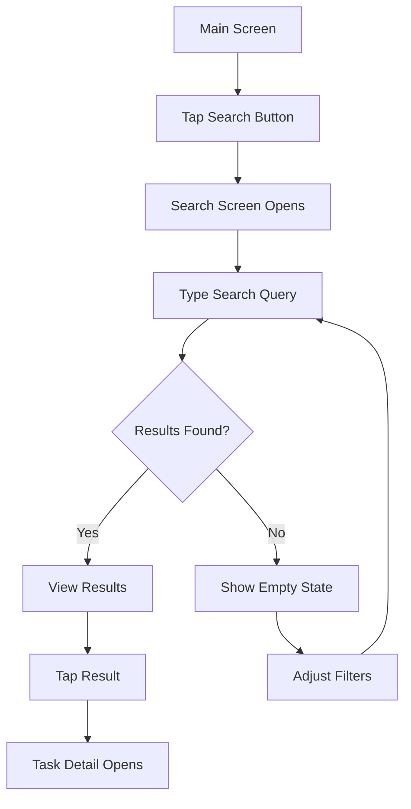
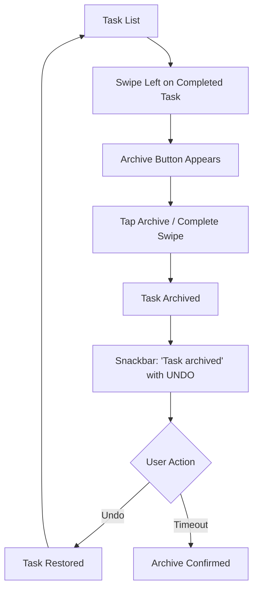
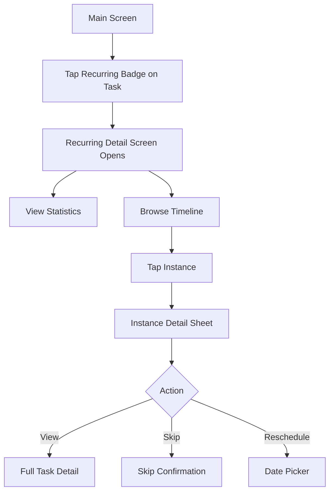
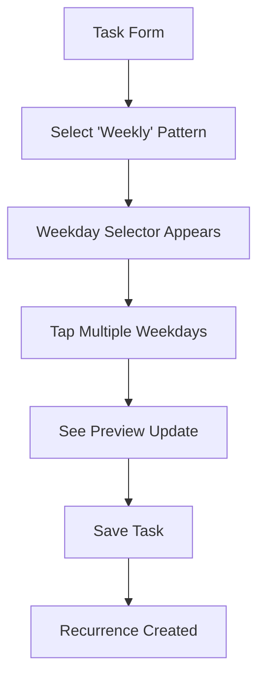

# v1.2.0 UI/UX Design Specifications

## Overview

This document outlines the user interface and user experience design for all v1.2.0 features, ensuring consistency with existing design patterns while introducing new capabilities.

---

## Design Principles

### Consistency
- Follow Material Design 3 guidelines (already established in v1.1.0)
- Maintain existing color scheme (light blue primary, pink secondary, purple tertiary)
- Use existing icon patterns and spacing

### Progressive Disclosure
- Basic features immediately visible
- Advanced options behind "More" or "Advanced" buttons
- Tooltips and help text for complex features

### Performance
- Instant feedback for all user actions
- Loading states for async operations
- Smooth animations and transitions

### Accessibility
- All interactive elements meet 48dp minimum touch target
- Sufficient color contrast (WCAG AA)
- Screen reader support
- Keyboard navigation support

---

## Feature 1: Task Search

### Search Entry Points

#### 1. Main Screen - Floating Search Button
**Location**: Bottom-right, above FAB or as secondary FAB  
**Appearance**:
- Icon: `Icons.search`
- Color: Primary theme color
- Size: 56dp diameter
- Elevation: 6dp
- Animation: Subtle pulse on first app launch (one-time hint)

**Behavior**:
- Tap → Opens search screen with focus on search field
- Long-press → Shows search tips tooltip

#### 2. App Bar Search Icon
**Location**: App bar, right side  
**Appearance**:
- Icon: `Icons.search`
- Size: 24dp
- Color: White (on primary color background)

**Behavior**:
- Tap → Opens search screen
- Shows badge dot if search history exists

### Search Screen Layout

```
┌─────────────────────────────────────────┐
│ ← [Search input field...          ] ⓧ  │ ← Top bar
│                                         │
│ [Recent Searches]                    ▼  │ ← Collapsible section
│ • "buy groceries"                    ✕  │
│ • "high priority"                    ✕  │
│ • "creative tasks"                   ✕  │
│ [Clear history]                         │
│                                         │
│ [Quick Filters]                      ▼  │ ← Filter chips
│ ⬡ High Priority  ⬡ Creative  ⬡ Home   │
│                                         │
│ [Advanced Filters]                      │ ← Button
│                                         │
│ ─────────────────────────────────────── │
│                                         │
│ [Results: 12 tasks]                     │ ← Results header
│                                         │
│ ┌─────────────────────────────────────┐ │
│ │ ✓ Buy groceries for dinner         │ │
│ │   Due tomorrow • Shopping           │ │ ← Search result
│ │   Match: "buy groceries"            │ │
│ └─────────────────────────────────────┘ │
│                                         │
│ ┌─────────────────────────────────────┐ │
│ │ ○ Write creative brief              │ │
│ │   High priority • Creative          │ │
│ │   Match: "creative" in type         │ │
│ └─────────────────────────────────────┘ │
│                                         │
│ [More results...]                       │
└─────────────────────────────────────────┘
```

### Search Input Field

**Specifications**:
- Height: 56dp
- Padding: 16dp horizontal
- Border radius: 28dp (fully rounded)
- Background: Surface color with elevation
- Elevation: 2dp

**Components**:
- Leading: Back arrow icon (← returns to main screen)
- Input: Single-line text field
- Placeholder: "Search tasks..."
- Trailing: Clear button (ⓧ, only shown when text present)

**Behavior**:
- Auto-focus on screen open
- Debounce: 300ms after last keystroke
- Show loading spinner in trailing position during search
- Clear button tap → Clears text and shows recent searches

### Recent Searches Section

**Appearance**:
- Header: "Recent Searches" with expand/collapse chevron
- List items: 
  - Icon: `Icons.history` (16dp, grey)
  - Search text (truncated at 40 chars)
  - Trailing: Remove button (ⓧ)
- Max display: 5 most recent
- Footer: "Clear history" link (if any searches exist)

**Behavior**:
- Tap search → Applies that search immediately
- Tap remove → Removes from history
- Clear history → Confirmation dialog → Removes all

### Quick Filters

**Display**:
- Horizontal scrollable chip row
- Chips: Outlined style when not selected, filled when selected
- Max visible: 3-4 (scroll for more)
- Icon + label on each chip

**Predefined Quick Filters**:
- 🔴 High Priority
- 💡 Creative
- 🏠 Home
- 💻 Computer needed
- ⚡ High energy
- ⏰ Due soon

**Behavior**:
- Tap chip → Toggles filter on/off
- Multiple chips can be active simultaneously
- Filters combine with AND logic
- Active chips show remove icon (ⓧ)
- Scroll horizontally to see all options

### Advanced Filters Sheet

**Trigger**: Tap "Advanced Filters" button  
**Presentation**: Bottom sheet, 70% screen height

**Layout**:
```
┌─────────────────────────────────────────┐
│ Advanced Filters                     ✕ │ ← Header
│ ─────────────────────────────────────── │
│                                         │
│ Task Type                            ▼  │
│ ⬡ Administrative  ⬡ Creative           │
│ ⬡ Technical  ⬡ Communication            │
│ ⬡ Physical                              │
│                                         │
│ Priority                             ▼  │
│ ⬡ Low (0)  ⬡ Medium (1)  ⬡ High (2)    │
│                                         │
│ Context                              ▼  │
│ ⬡ Home  ⬡ Office  ⬡ Outdoor            │
│ ⬡ Anywhere  ⬡ Specific Room             │
│                                         │
│ Energy Level                         ▼  │
│ ⬡ Low  ⬡ Medium  ⬡ High                │
│                                         │
│ Time Estimate                        ▼  │
│ ⬡ Very Short  ⬡ Short  ⬡ Medium        │
│ ⬡ Long  ⬡ Very Long                    │
│                                         │
│ ─────────────────────────────────────── │
│ [Show Completed] ☐                      │
│ [Show Archived] ☐                       │
│ ─────────────────────────────────────── │
│                                         │
│ [Clear All]    [Apply (12 tasks)]       │ ← Footer
└─────────────────────────────────────────┘
```

**Sections**: All collapsible to reduce visual clutter  
**Chips**: Multi-select within each category  
**Live Count**: "Apply (X tasks)" updates as filters change  
**Actions**: 
- Clear All → Removes all filter selections
- Apply → Applies filters and closes sheet

### Search Results List

**Display**:
- Standard task list item format (reuse existing widgets)
- Highlight matched text in yellow background
- Show match context below task name (dimmed text)
- Empty state when no results

**Empty States**:

**No results for search**:
```
    🔍
    
No tasks found for "your search"

Try different keywords or adjust filters
```

**No tasks in system**:
```
    📝
    
No tasks yet

Create your first task to get started
```

**Interactions**:
- Tap task → Opens task detail (existing behavior)
- Swipe actions work normally
- Long-press for context menu

---

## Feature 2: Task Archiving

### Archive Action Access Points

#### 1. Swipe Actions on Completed Tasks
**Gesture**: Swipe left on completed task  
**Reveal**: Archive button (grey background, box icon)  
**Swipe distance**: Full swipe auto-archives

#### 2. Long-Press Context Menu
**Trigger**: Long-press on completed task  
**Menu Options**:
- ✏️ Edit
- 🗄️ Archive
- 🗑️ Delete

#### 3. Bulk Selection Mode
**Enable**: Long-press on first task  
**Selection UI**:
- Checkboxes appear on all tasks
- Selected count in app bar: "(3) selected"
- Bottom action bar appears

**Bulk Actions**:
- [Archive] - Grey button
- [Delete] - Red button
- Filter: Only show actions valid for selection (e.g., archive only for completed)

#### 4. Auto-Archive Settings
**Location**: Settings screen → Task Management section  
**UI**:
```
Auto-Archive Completed Tasks
┌─────────────────────────────────┐
│ [Enabled] ◉ On  ○ Off           │
│                                 │
│ Archive after: 30 days     ▼   │
│                                 │
│ Options: 7, 14, 30, 60, 90 days │
│                                 │
│ Next auto-archive: Tomorrow     │
└─────────────────────────────────┘
```

### Archive Screen

**Access**: Main screen menu → "Archive" (shows count badge)

**Layout**:
```
┌─────────────────────────────────────────┐
│ ← Archive (127)                    ⋮   │ ← Header
│ ─────────────────────────────────────── │
│                                         │
│ [Search archived tasks...]          🔍 │ ← Search
│                                         │
│ Sort: [Most Recent ▼]  Filter: [All ▼] │ ← Controls
│                                         │
│ ═══════════════════════════════════════ │
│                                         │
│ This Week (5)                        ▼  │ ← Grouped by time
│ ┌─────────────────────────────────────┐ │
│ │ ✓ Complete project proposal       ↻ │ │
│ │   Archived 2 days ago • Technical   │ │
│ │   Completed Oct 5                   │ │
│ └─────────────────────────────────────┘ │
│                                         │
│ ┌─────────────────────────────────────┐ │
│ │ ✓ Buy birthday gift              ↻ │ │
│ │   Archived 3 days ago • Personal    │ │
│ │   Completed Oct 4                   │ │
│ └─────────────────────────────────────┘ │
│                                         │
│ Last Month (8)                       ▼  │
│ [...]                                   │
│                                         │
│ Older (114)                          ▼  │
│ [...]                                   │
└─────────────────────────────────────────┘
```

**Grouping Options**:
- By archive date: This week, Last month, Older
- By completion date: This week, Last month, Older  
- By task type: Creative, Administrative, etc.
- No grouping (flat list)

**Sort Options**:
- Most recently archived (default)
- Oldest archived
- Most recently completed
- Alphabetical

**Filter Options**:
- All archived tasks
- By task type
- By priority
- By time period (last 7/30/90 days, older)

### Archived Task Item

**Visual Differences from Active Tasks**:
- Slightly grayed-out appearance (70% opacity)
- Archive indicator badge: 🗄️ "Archived"
- Shows both completion date and archive date
- Trailing restore icon (↻) instead of checkbox

**Item Layout**:
```
┌─────────────────────────────────────┐
│ ✓ Task title (grayed)             ↻ │ ← Restore button
│   Archived 5 days ago • Type        │ ← Meta info
│   Completed Oct 2                   │ ← Completion date
│   [Tag1] [Tag2]                     │ ← Tags (if present)
└─────────────────────────────────────┘
```

**Interactions**:
- Tap item → Opens read-only task detail with restore option
- Tap restore icon (↻) → Confirmation → Unarchives task
- Swipe left → Reveals "Delete Permanently" (red background)
- Long-press → Context menu: View, Restore, Delete

### Archive Actions

#### Restore Confirmation
```
┌─────────────────────────────────┐
│     Restore Task?               │
│                                 │
│ "Buy groceries"                 │
│                                 │
│ This task will be moved back    │
│ to your active tasks list.      │
│                                 │
│ [Cancel]         [Restore]      │
└─────────────────────────────────┘
```

#### Permanent Delete Confirmation
```
┌─────────────────────────────────┐
│     Delete Permanently?         │
│                                 │
│ "Buy groceries"                 │
│                                 │
│ ⚠️ This cannot be undone.       │
│ The task will be permanently    │
│ deleted from the archive.       │
│                                 │
│ [Cancel]         [Delete]       │ ← Red text
└─────────────────────────────────┘
```

#### Clear Archive Confirmation
```
┌─────────────────────────────────┐
│     Clear Entire Archive?       │
│                                 │
│ ⚠️ This will permanently        │
│ delete all 127 archived tasks.  │
│                                 │
│ This action cannot be undone.   │
│                                 │
│ [Cancel]         [Delete All]   │ ← Red text
└─────────────────────────────────┘
```

### Archive Settings

**Location**: Settings → Task Management

```
┌─────────────────────────────────────┐
│ Archive Settings                    │
│ ─────────────────────────────────── │
│                                     │
│ Auto-Archive                        │
│ ◉ Enabled    ○ Disabled             │
│                                     │
│ Archive completed tasks after:      │
│ [════●════════════] 30 days         │
│ 7        30        60        90     │
│                                     │
│ Archive Count: 127 tasks            │
│ Storage Used: ~2.3 MB               │
│                                     │
│ ─────────────────────────────────── │
│ Danger Zone                         │
│                                     │
│ [Clear Archive]                     │ ← Red outline
│ Permanently delete all archived     │
│ tasks. This cannot be undone.       │
└─────────────────────────────────────┘
```

---

## Feature 3: Recurring Task History

### Access Points

#### 1. Recurring Badge Tap
**On any recurring task**, tap the purple "Repeats" badge → Opens recurring task detail screen

#### 2. Long-Press Menu
Long-press recurring task → Menu includes "View History" option

#### 3. Recurring Tasks Filter
Main screen → Filter menu → "Recurring Tasks" filter → Shows list with "View History" buttons

### Recurring Task Detail Screen

**Layout**:
```
┌─────────────────────────────────────────┐
│ ← Recurring Task: [Task Title]      ⋮  │ ← Header
│ ─────────────────────────────────────── │
│                                         │
│ OVERVIEW                                │
│ ┌─────────────────────────────────────┐ │
│ │ 📋 Task: Write weekly report        │ │
│ │ 🔄 Pattern: Every Monday            │ │
│ │ 📅 Started: Jan 1, 2025             │ │
│ │ 🎯 Status: Active • 12 instances    │ │
│ │                                     │ │
│ │ [Edit Recurrence] [Stop Recurrence] │ │
│ └─────────────────────────────────────┘ │
│                                         │
│ STATISTICS                           ▼  │
│ ┌─────────────────────────────────────┐ │
│ │ ┌───────┐  ┌───────┐  ┌───────┐   │ │
│ │ │ 75%   │  │ 🔥 3  │  │ 🏆 5  │   │ │
│ │ │Complete│  │Streak │  │ Best  │   │ │
│ │ └───────┘  └───────┘  └───────┘   │ │
│ │                                     │ │
│ │ 9 of 12 completed • 1 skipped       │ │
│ │ 2 overdue • Next: Tomorrow          │ │
│ │                                     │ │
│ │ ━━━━━━━━━━━━━━━━━━━━━ 75%          │ │ ← Progress bar
│ └─────────────────────────────────────┘ │
│                                         │
│ INSTANCE TIMELINE            [📅] [📋] │ ← View toggles
│ ┌─────────────────────────────────────┐ │
│ │ UPCOMING                            │ │
│ │ ○ Tomorrow, Oct 8              Next │ │
│ │ ○ Mon, Oct 15                       │ │
│ │ ○ Mon, Oct 22                       │ │
│ │                                     │ │
│ │ THIS MONTH                          │ │
│ │ ✓ Mon, Oct 1       On time     View │ │
│ │ ⊘ Mon, Oct 8       Skipped     Undo │ │
│ │ ✓ Mon, Oct 15      1 day late  View │ │
│ │                                     │ │
│ │ OLDER                               │ │
│ │ ✓ Mon, Sep 24      On time     View │ │
│ │ ✓ Mon, Sep 17      On time     View │ │
│ │ [Show more...]                      │ │
│ └─────────────────────────────────────┘ │
└─────────────────────────────────────────┘
```

### Statistics Cards

#### Completion Rate Card
```
┌─────────────────────┐
│       75%           │ ← Large number
│   Completion        │
│   ━━━━━━━━━━━ 75%   │ ← Progress bar
│   9 of 12 done      │
└─────────────────────┘
```

#### Current Streak Card
```
┌─────────────────────┐
│      🔥 3           │ ← Fire emoji + number
│   Day Streak        │
│   Keep it going!    │
└─────────────────────┘
```
- Color: Orange gradient when active
- Grey when streak = 0
- Pulse animation on streak increment

#### Longest Streak Card
```
┌─────────────────────┐
│      🏆 5           │ ← Trophy + number
│   Best Streak       │
│   Personal record   │
└─────────────────────┘
```
- Gold color
- Confetti animation when new record set

### Instance Timeline Views

#### List View (Default)
- Chronological order (newest first)
- Grouped by time period
- Expandable/collapsible groups
- Shows completion status, due date, completion date
- Quick actions on each instance

#### Calendar View
**Trigger**: Tap calendar icon (📅)

```
         October 2025
┌───┬───┬───┬───┬───┬───┬───┐
│ S │ M │ T │ W │ T │ F │ S │
├───┼───┼───┼───┼───┼───┼───┤
│   │   │   │ 1 │ 2 │ 3 │ 4 │
│   │   │   │ ✓ │   │   │   │ ← Completed
├───┼───┼───┼───┼───┼───┼───┤
│ 5 │ 6 │ 7 │ 8 │ 9 │10 │11 │
│   │   │   │ ⊘ │   │   │   │ ← Skipped
├───┼───┼───┼───┼───┼───┼───┤
│12 │13 │14 │15 │16 │17 │18 │
│   │   │   │ ✓ │   │   │   │ ← Completed (late)
├───┼───┼───┼───┼───┼───┼───┤
│19 │20 │21 │22 │23 │24 │25 │
│   │   │   │ ○ │   │   │   │ ← Upcoming
└───┴───┴───┴───┴───┴───┴───┘

Legend:
✓ Completed  ⊘ Skipped  
✗ Missed     ○ Upcoming
```

**Color coding**:
- ✓ Green: Completed on time
- ✓ Orange: Completed late
- ⊘ Grey: Skipped
- ✗ Red: Missed/overdue
- ○ Blue: Upcoming

**Interactions**:
- Tap date → Shows instance detail bottom sheet
- Swipe left/right → Change month
- Tap legend → Filter by status

### Instance Actions

#### Skip Instance Dialog
```
┌─────────────────────────────────┐
│     Skip This Instance?         │
│                                 │
│ Monday, October 8               │
│                                 │
│ Mark as intentionally skipped?  │
│ This won't affect your streak.  │
│                                 │
│ Add reason (optional):          │
│ ┌─────────────────────────────┐ │
│ │ On vacation                 │ │
│ └─────────────────────────────┘ │
│                                 │
│ [Cancel]         [Skip]         │
└─────────────────────────────────┘
```

#### Reschedule Instance Dialog
```
┌─────────────────────────────────┐
│     Reschedule Instance         │
│                                 │
│ Current: Monday, October 8      │
│                                 │
│ New date:                       │
│ ┌─────────────────────────────┐ │
│ │ 📅 October 10, 2025         │ │ ← Date picker
│ └─────────────────────────────┘ │
│                                 │
│ ⚠️ This only affects this       │
│ instance. Future instances      │
│ will follow the regular pattern.│
│                                 │
│ [Cancel]         [Reschedule]   │
└─────────────────────────────────┘
```

#### Edit Series Options
```
┌─────────────────────────────────┐
│     Edit Recurring Task         │
│                                 │
│ What would you like to edit?    │
│                                 │
│ ○ This instance only            │
│   Changes won't affect future   │
│                                 │
│ ○ This and future instances     │
│   Past instances unchanged      │
│                                 │
│ ○ Entire series                 │
│   All instances will update     │
│                                 │
│ [Cancel]         [Continue]     │
└─────────────────────────────────┘
```

### Instance Detail Bottom Sheet

**Trigger**: Tap instance in timeline

```
┌─────────────────────────────────────────┐
│ Instance Detail                      ✕ │
│ ─────────────────────────────────────── │
│                                         │
│ Write weekly report                     │
│ Monday, October 8, 2025                 │
│                                         │
│ Status: ✓ Completed                     │
│ Completed: October 8, 3:45 PM           │
│ On time: ✅ Yes                         │
│                                         │
│ Instance: 8 of 12                       │
│ Part of: "Weekly Reports" series        │
│                                         │
│ ─────────────────────────────────────── │
│                                         │
│ [View Full Task]                        │
│ [Reschedule]      [Skip]                │
└─────────────────────────────────────────┘
```

---

## Feature 4: Advanced Recurrence Patterns

### Enhanced Recurrence Picker

**Location**: Task form → Recurrence section (expanded from v1.1.0)

#### Pattern Selector (Updated)
```
┌─────────────────────────────────────┐
│ Recurrence Pattern              ▼  │
│                                     │
│ ○ None (one-time task)              │
│ ○ Daily                             │
│ ● Weekly                            │ ← Selected
│ ○ Biweekly                          │
│ ○ Monthly                           │
│ ○ Yearly                            │
│ ○ Custom (every N days)             │
└─────────────────────────────────────┘
```

**NEW**: Each pattern expands to show advanced options

### Weekly Pattern - Advanced Options

```
┌─────────────────────────────────────┐
│ ● Weekly                            │
│                                     │
│ Repeat on:                          │
│ ┌─────────────────────────────────┐ │
│ │ [S] [M] [T] [W] [T] [F] [S]    │ │ ← Weekday buttons
│ │      ●   ●       ●              │ │ ← M, W, F selected
│ └─────────────────────────────────┘ │
│                                     │
│ Or: [Every Monday ▼]                │ ← Quick presets
│                                     │
│ Presets:                            │
│ • Weekdays (Mon-Fri)                │
│ • Weekends (Sat-Sun)                │
│ • Every Monday                      │
│ • Mon, Wed, Fri                     │
└─────────────────────────────────────┘
```

**Weekday Selector**:
- Toggle buttons: Unselected=outlined, Selected=filled
- Colors: Primary theme when selected
- Minimum: 1 weekday required
- Maximum: All 7 allowed

**Behavior**:
- Tap button → Toggles selection
- Selected days highlighted in primary color
- Validation: At least one day must be selected
- Auto-selects current weekday when switching to weekly pattern

### Monthly Pattern - Advanced Options

```
┌─────────────────────────────────────┐
│ ● Monthly                           │
│                                     │
│ Repeat by:                          │
│ ◉ Day of Month  ○ Day of Week       │ ← Tab selector
│                                     │
│ ┌─── Day of Month ─────────────────┐│
│ │                                   ││
│ │ Day: [15 ▼]                       ││ ← 1-31, Last
│ │                                   ││
│ │ Examples:                         ││
│ │ • 15th of each month              ││
│ │ • Last day of each month (-1)     ││
│ │                                   ││
│ └───────────────────────────────────┘│
└─────────────────────────────────────┘
```

**Day of Month Options**:
- Dropdown: 1, 2, 3, ..., 30, 31, Last day
- Validates for current month
- Shows warning if day > 28 (not all months have it)
- "Last day" option (-1) handles varying month lengths

**Alternative: Day of Week Tab**:
```
┌─── Day of Week ───────────────────┐
│                                   │
│ Week: [First ▼]                   │ ← Week selector
│   Options: First, Second, Third,  │
│            Fourth, Last           │
│                                   │
│ Day: [Monday ▼]                   │ ← Weekday selector
│   Options: Mon-Sun                │
│                                   │
│ Examples:                         │
│ • First Monday of each month      │
│ • Last Friday of each month       │
│                                   │
└───────────────────────────────────┘
```

**Week Selector Options**:
- First, Second, Third, Fourth, Last
- Dropdown format

**Day Selector**:
- Monday through Sunday
- Dropdown format
- Icon preview next to selection

### Recurrence Preview Widget

**Location**: Below recurrence configuration

```
┌─────────────────────────────────────┐
│ Next 5 Occurrences                  │
│ ─────────────────────────────────── │
│ 1. Mon, Oct 7, 2025                 │
│ 2. Wed, Oct 9, 2025                 │
│ 3. Fri, Oct 11, 2025                │
│ 4. Mon, Oct 14, 2025                │
│ 5. Wed, Oct 16, 2025                │
│ ...                                 │
└─────────────────────────────────────┘
```

**Features**:
- Shows next 5 dates (or fewer if near end)
- Updates live as pattern changes
- Collapsible section
- Helps users verify pattern correctness
- Shows "(last instance)" if within 5 occurrences

### End Conditions (Enhanced from v1.1.0)

```
┌─────────────────────────────────────┐
│ Ends:                               │
│ ◉ Never  ○ On Date  ○ After Count   │ ← Radio buttons
│                                     │
│ [Currently: Never]                   │
│                                     │
│ ───────── When "On Date" selected ─ │
│ End date:                           │
│ ┌─────────────────────────────────┐ │
│ │ 📅 December 31, 2025            │ │
│ └─────────────────────────────────┘ │
│                                     │
│ Preview: 12 occurrences              │
│ ─────────────────────────────────── │
│                                     │
│ ───────── When "After Count" ────── │
│ Number of occurrences:              │
│ ┌─────────────────────────────────┐ │
│ │ 10                              │ │
│ └─────────────────────────────────┘ │
│                                     │
│ Last occurrence: Oct 15, 2025       │
└─────────────────────────────────────┘
```

### Date Exclusions (Optional - Can defer)

```
┌─────────────────────────────────────┐
│ Skip Specific Dates              ▼  │ ← Collapsible
│                                     │
│ [+ Add excluded date]               │
│                                     │
│ 🚫 Dec 25, 2025 (Holiday)        ✕ │
│ 🚫 Jan 1, 2026 (Holiday)         ✕ │
│                                     │
│ Note: Instances won't be created   │
│ on these dates. The pattern will   │
│ skip to the next valid date.       │
└─────────────────────────────────────┘
```

---

## UI Components Reusability

### Existing Components to Reuse

**From v1.1.0**:
- ✅ Task list item layout ([`task_item_enhanced.dart`](../../lib/widgets/task_item_enhanced.dart))
- ✅ Priority badges
- ✅ Metadata chips (type, context, etc.)
- ✅ Date picker dialogs
- ✅ Confirmation dialogs
- ✅ Empty state widgets

**Modifications Needed**:
- Add archive visual treatment (opacity)
- Add restore button to task item
- Add search highlighting to text
- Add streak indicators

### New Components to Create

**Search Components**:
1. `SearchBar` widget - Debounced input with clear button
2. `SearchFilterChip` - Removable filter chip
3. `SearchResultItem` - Task item with match highlighting
4. `AdvancedFiltersSheet` - Bottom sheet with all filters

**Archive Components**:
5. `ArchivedTaskItem` - Modified task item for archive view
6. `ArchiveGroupHeader` - Time-based grouping header
7. `RestoreButton` - Restore action button

**Recurring History Components**:
8. `RecurringStatsCard` - Statistics display card
9. `StreakIndicator` - Fire/trophy emoji with number
10. `InstanceTimelineItem` - Individual instance in timeline
11. `RecurrencePreviewList` - Next N occurrences
12. `CalendarInstanceView` - Monthly calendar with markers

**Advanced Recurrence Components**:
13. `WeekdaySelector` - Multi-select weekday buttons
14. `MonthlyPatternSelector` - By date vs. by weekday tabs
15. `WeekOfMonthPicker` - First/Second/Third/Fourth/Last selector
16. `RecurrencePreview` - Live preview of next dates

---

## Color Palette

### Existing Colors (v1.1.0)
- Primary: #87CEEB (Light Blue)
- Secondary: #E91E63 (Pink)
- Tertiary: #9C27B0 (Purple)

### New Colors (v1.2.0)
- **Archive**: #9E9E9E (Grey)
- **Streak Active**: #FF9800 (Orange)
- **Streak Record**: #FFD700 (Gold)
- **Search Highlight**: #FFEB3B50 (Yellow with 50% opacity)
- **Skipped**: #757575 (Dark Grey)
- **On Time**: #4CAF50 (Green)
- **Late**: #FFC107 (Amber)

---

## Icon Mapping

### New Icons

**Search**:
- `Icons.search` - Search button, screen header
- `Icons.history` - Recent searches
- `Icons.filter_list` - Advanced filters
- `Icons.highlight` - Search match indicator

**Archive**:
- `Icons.archive` - Archive button, screen icon
- `Icons.unarchive` - Restore/unarchive button
- `Icons.inventory_2` - Archive box (alternative)
- `Icons.delete_forever` - Permanent delete

**Recurring History**:
- `Icons.timeline` - Timeline view
- `Icons.calendar_month` - Calendar view
- `Icons.show_chart` - Statistics
- `Icons.skip_next` - Skip instance
- `Icons.schedule` - Reschedule instance
- `Icons.check_circle` - Completed instance
- `Icons.cancel` - Skipped instance
- `Icons.error_outline` - Overdue instance

**Advanced Recurrence**:
- `Icons.calendar_view_week` - Weekday selector
- `Icons.calendar_view_month` - Monthly by weekday
- `Icons.event_repeat` - Repeating pattern
- `Icons.edit_calendar` - Edit recurrence

**Streaks**:
- 🔥 Fire emoji - Current streak (use Flutter emoji support)
- 🏆 Trophy emoji - Longest streak
- ⭐ Star - Achievement milestone

---

## Animation Specifications

### Search Animations
- **Search bar expand**: 200ms ease-out
- **Results fade in**: Stagger 50ms per item (max 10 items)
- **Filter chip add/remove**: 150ms scale + fade

### Archive Animations
- **Swipe to archive**: Follow finger with elastic snap
- **Archive screen transition**: 300ms slide from right
- **Restore action**: 200ms fade out → 300ms fade in at new position

### Recurring History Animations
- **Stats cards**: Count-up animation over 500ms
- **Streak increment**: Pulse + confetti (300ms)
- **Timeline expand**: 200ms ease-out
- **Calendar month swipe**: 250ms slide

### General
- **Bottom sheet slide**: 300ms ease-out
- **Dialog fade**: 200ms fade in/out
- **Loading spinner**: Continuous rotation
- **Success feedback**: Checkmark animation (500ms)

---

## Accessibility

### Screen Reader Support

**Search**:
- "Search button"
- "Search tasks, tap to open search"
- "12 results found for [query]"

**Archive**:
- "Archive button, archives completed task"
- "Restore task [name]"
- "127 archived tasks"

**Recurring History**:
- "Current streak: 3 days"
- "Completion rate: 75 percent"
- "Instance due [date], completed on [date]"

**Advanced Recurrence**:
- "Monday selected, tap to deselect"
- "Select week of month, currently First"
- "Next 5 occurrences: [list of dates]"

### Keyboard Navigation

**Search Screen**:
- Tab: Move through filters and results
- Enter: Select highlighted result or apply filters
- Escape: Close search screen
- Ctrl+F / Cmd+F: Focus search (if on main screen)

**Archive Screen**:
- Tab: Navigate through archived tasks
- R: Restore highlighted task
- Delete: Delete highlighted task (with confirmation)

### Color Contrast

All color combinations tested for WCAG AA compliance:
- ✅ Search highlight on white background: 4.5:1
- ✅ Archive grey on white: 4.5:1
- ✅ Streak orange on white: 4.5:1
- ✅ All status colors meet minimum contrast

---

## Responsive Design

### Phone (< 600dp width)
- Single column layouts
- Bottom sheets for all modal content
- Floating action buttons
- Collapsible sections by default

### Tablet (>= 600dp width)
- Two-column layout where appropriate
- Dialogs instead of bottom sheets
- Side panel for filters (search, archive)
- Expanded statistics cards

### Landscape Orientation
- Adjust for wider screen
- Show more content per screen
- Side-by-side layouts for detail views

---

## Empty States

### Search - No Results
```
        🔍
        
No tasks found

Try different search terms
or adjust your filters

[Clear Filters]
```

### Archive - Empty
```
        🗄️
        
No archived tasks

Completed tasks will appear
here when archived

[Learn about archiving]
```

### Recurring History - No Instances
```
        📅
        
No instances yet

Complete this recurring task
to see your progress here

[Back to Task]
```

### Recurring History - No Statistics
```
        📊
        
Not enough data yet

Complete at least 2 instances
to see statistics

[View Timeline]
```

---

## Loading States

### Search Loading
- Spinner in search bar (trailing position)
- Skeleton screens for results (3-5 shimmer placeholders)
- Debounced to avoid showing on every keystroke

### Archive Loading
- Skeleton screens for task list
- "Loading archived tasks..." text
- Progress indicator if >1000 tasks

### Statistics Calculation
- Spinner overlay on stats card
- "Calculating..." text
- Minimal duration: 200ms (avoid flash)

---

## Error States

### Search Error
```
        ⚠️
        
Search Failed

An error occurred while searching.
Please try again.

[Retry]
```

### Archive Error
```
        ⚠️
        
Archive Failed

Could not archive task.
Please try again.

[Dismiss]    [Retry]
```

### Statistics Error
```
        ⚠️
        
Unable to Load Statistics

Check your connection and try again.

[Back]    [Retry]
```

---

## Interaction Patterns

### Confirmation Dialogs

**When to confirm**:
- ✅ Permanent delete (archive or regular)
- ✅ Clear archive (bulk delete)
- ✅ Stop recurrence (affects future instances)
- ❌ Archive (reversible, no confirmation)
- ❌ Restore (reversible, no confirmation)
- ❌ Skip instance (low consequence, easy to undo)

### Undo/Snackbar Feedback

**Show snackbar after**:
- Archive task: "Task archived" with UNDO action (8s timeout)
- Restore task: "Task restored" (3s timeout, no undo needed)
- Skip instance: "Instance skipped" with UNDO action (8s timeout)
- Auto-archive execution: "15 tasks auto-archived" with VIEW action

### Progressive Disclosure

**Simple → Advanced** flow:
1. **Basic recurrence**: Just pattern dropdown (existing v1.1.0 UI)
2. **Tap "Advanced"**: Shows weekday selector or monthly options
3. **Tap "End Conditions"**: Expands to show end date/count options
4. **Tap "Exclusions"**: Shows date exclusion list (future)

**Benefits**:
- Reduces initial complexity
- Power users can access advanced features
- New users not overwhelmed

---

## User Flows

### Flow 1: Search for a Task



**Steps**:
1. User taps search button
2. Search screen opens with keyboard
3. User types query (debounced search after 300ms)
4. Results appear as user types
5. User taps result to view task detail

**Alternative**: User applies advanced filters before or after text search

### Flow 2: Archive a Completed Task



**Steps**:
1. User swipes left on completed task
2. Archive button revealed
3. Tap or complete swipe → Task archived
4. Snackbar appears with undo option
5. 8 seconds to undo, then permanent (until restored from archive)

### Flow 3: View Recurring Task History



**Steps**:
1. User taps "Repeats Weekly" badge on task
2. Recurring detail screen opens
3. User sees statistics at top
4. Scrolls through timeline of instances
5. Taps specific instance
6. Bottom sheet shows instance details
7. User can view, skip, or reschedule

### Flow 4: Configure Advanced Weekly Pattern



**Steps**:
1. User creates/edits task
2. Selects "Weekly" recurrence pattern
3. Weekday selector expands
4. User taps Mon, Wed, Fri
5. Preview shows next 5 occurrences
6. User saves task
7. Recurrence rule created with selected weekdays

---

## Mobile-Specific Considerations

### iOS
- Use Cupertino date picker for date selections
- Follow iOS conventions for swipe actions
- Native share sheet integration (future)
- Haptic feedback on important actions

### Android
- Material date picker (already used)
- Material bottom sheets
- Snackbar for feedback
- Ripple effects on taps

### Cross-Platform
- Test on both iOS and Android
- Verify date formatting matches locale
- Ensure touch targets meet platform guidelines
- Consistent behavior across platforms

---

## Performance Optimization

### Search Optimization
- Debounce input: 300ms
- Limit initial results: 50 tasks
- Lazy load additional results
- Cancel previous searches if new query started
- Use `ListView.builder` for results

### Archive Screen Optimization
- Virtual scrolling with `ListView.builder`
- Load 50 tasks initially
- Load more on scroll (pagination)
- Cache rendered items
- Dispose off-screen items

### Statistics Optimization
- Calculate once, cache result
- Invalidate cache on instance completion/skip
- Use `FutureBuilder` with memo
- Show cached data immediately, refresh in background

### Advanced Recurrence Optimization
- Pre-calculate next 5 dates on save
- Cache calculation results
- Use isolates for complex calculations (if needed)
- Limit preview to 5-10 dates

---

## Usability Testing Checklist

### Search Feature
- [ ] Can find task in <5 seconds
- [ ] Search results relevant to query
- [ ] Filters work as expected
- [ ] Search history saves correctly
- [ ] Clear and intuitive UI

### Archive Feature
- [ ] Archive action discoverable
- [ ] Restore is obvious and easy
- [ ] Archive doesn't clutter main view
- [ ] Auto-archive works as configured
- [ ] No accidental permanent deletions

### Recurring History
- [ ] Statistics make sense to users
- [ ] Timeline easy to navigate
- [ ] Instance actions clear
- [ ] Streak motivates users
- [ ] Preview helps understanding

### Advanced Recurrence
- [ ] Patterns easy to configure
- [ ] Preview helps verify pattern
- [ ] Advanced options not overwhelming
- [ ] Most users can create desired pattern
- [ ] Error messages helpful

---

## Design Assets Needed

### Icons
- All Material Icons (no custom assets needed)
- Emoji support for streaks (🔥, 🏆)

### Illustrations
- Empty state graphics (optional, can use icons)
- Onboarding slides for new features (optional)

### Animations
- All CSS/Flutter animations (no Lottie or video)
- Confetti effect for new streak record (Flutter particles)

---

## Help & Onboarding

### Feature Discovery

**First Use Tooltips**:
1. Search button: "Tap to search your tasks"
2. Archive swipe: "Swipe to archive completed tasks"
3. Recurring badge: "Tap to view history and stats"
4. Advanced recurrence: "Create complex repeating patterns"

**Show once, dismissible, stored in SharedPreferences**

### Help Documentation

**In-app help screens** (accessible from menu):
- Search tips and tricks
- Archive vs. delete explanation
- Understanding recurring task statistics
- Advanced recurrence pattern examples

**Format**: Simple scrollable page with examples and screenshots

---

## Summary

**Total New UI Components**: 16  
**Modified Components**: 4  
**New Screens**: 4 (Search, Archive, Recurring Detail, Help)  
**New Dialogs/Sheets**: 8  

**Design Complexity**: MEDIUM
- Reuses existing design system
- Follows established patterns
- New components are variations of existing
- Clear visual hierarchy

**Implementation Effort**: 
- High-fidelity mockups: Not required (specs sufficient)
- Component library: Extends existing widgets
- User testing: Recommended before final release

---

**Status**: UI/UX SPECIFICATION COMPLETE
**Next**: Migration strategy and implementation guide