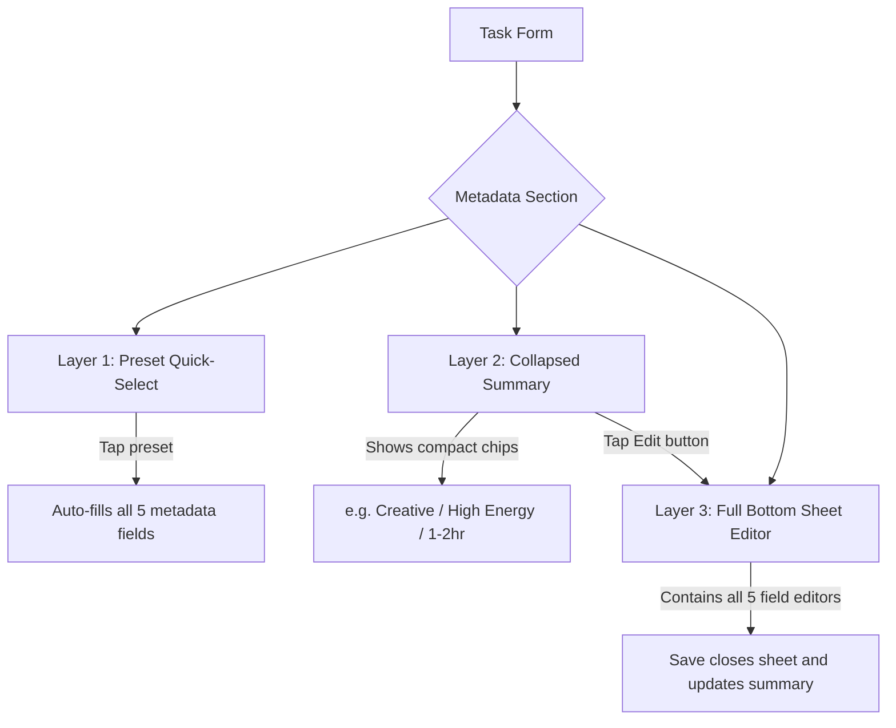
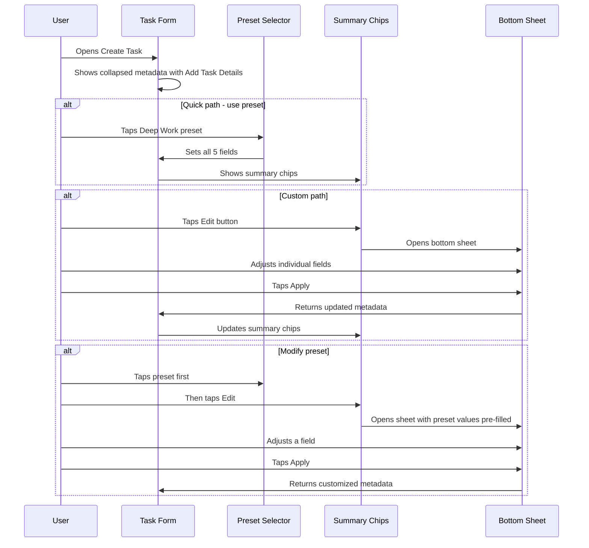

# v1.3.0 UI Overhaul Plan

**Status: COMPLETED**

## Overview

This release focuses on two key areas:
1. **Color scheme update** — align the entire app with the new Sike logo brand colors
2. **Metadata UX improvement** — make task metadata selection faster and less overwhelming

**Current Version**: 1.2.0  
**Target Version**: 1.3.0

---

## 1. Color Scheme Update

### Design Goal: Centralized Color Management

Currently colors are scattered across [`main.dart`](lib/main.dart:94) (theme), [`constants.dart`](lib/utils/constants.dart:87) (priority colors), [`task_enums.dart`](lib/models/task_enums.dart:294) (status colors), and 15+ widget files with hardcoded `Colors.*` references.

**The key architectural change**: Create a single [`lib/utils/app_colors.dart`](lib/utils/app_colors.dart) file that defines ALL app colors in one place. All other files reference this class instead of hardcoding `Color(0xFF...)` or `Colors.*` values. This makes future rebranding a single-file change.

### Brand Colors

| Role | Current | New | Hex |
|------|---------|-----|-----|
| **Primary** | Light blue `#87CEEB` | Navy blue | `#275790` |
| **Secondary** | Pink `#E91E63` | Green | `#57AF62` |
| **Tertiary** | Purple `#9C27B0` | *(derive from palette)* | TBD by Material3 |
| **Dark Primary** | `#5FA8D3` | Muted navy | `#1E4570` |
| **Dark Secondary** | `#C2185B` | Muted green | `#3D8B4A` |

### New File: [`lib/utils/app_colors.dart`](lib/utils/app_colors.dart)

This file centralizes ALL color definitions:

```dart
import 'package:flutter/material.dart';

/// Centralized color definitions for the Sike app.
/// To rebrand the app, update colors HERE ONLY.
class AppColors {
  // === Brand Colors ===
  static const Color brandPrimary = Color(0xFF275790);     // Navy blue
  static const Color brandSecondary = Color(0xFF57AF62);   // Green
  
  // === Dark Mode Brand Variants ===
  static const Color brandPrimaryDark = Color(0xFF1E4570);
  static const Color brandSecondaryDark = Color(0xFF3D8B4A);
  
  // === Semantic Colors (status/meaning) ===
  static const Color success = Color(0xFF4CAF50);          // Green - completion
  static const Color warning = Color(0xFFFF9800);          // Orange - caution
  static const Color error = Color(0xFFF44336);            // Red - overdue/delete
  static const Color info = Color(0xFF275790);             // Uses brand primary
  
  // === Priority Colors ===
  static const Color priorityLow = Color(0xFF4CAF50);      // Green
  static const Color priorityMedium = Color(0xFFFF9800);   // Orange
  static const Color priorityHigh = Color(0xFFF44336);     // Red
  
  // === Due Date Status Colors ===
  static const Color statusNone = Color(0xFF9E9E9E);       // Grey
  static const Color statusOverdue = Color(0xFFF44336);    // Red
  static const Color statusDueToday = Color(0xFFFF9800);   // Orange
  static const Color statusUpcoming = Color(0xFF275790);   // Brand primary
  static const Color statusFuture = Color(0xFFBDBDBD);     // Light grey
  
  // === Recurring Task Colors ===
  static const Color streakActive = Color(0xFFFF5722);     // Deep orange
  static const Color streakRecord = Color(0xFFFFC107);     // Amber
  
  // === Energy Level Colors ===
  static const Color energyHigh = Color(0xFFF44336);       // Red
  static const Color energyMedium = Color(0xFFFF9800);     // Orange
  static const Color energyLow = Color(0xFF4CAF50);        // Green
  
  // === Light Theme ===
  static ColorScheme lightColorScheme() => ColorScheme.fromSeed(
    seedColor: brandPrimary,
    primary: brandPrimary,
    secondary: brandSecondary,
    brightness: Brightness.light,
  );
  
  // === Dark Theme ===
  static ColorScheme darkColorScheme() => ColorScheme.fromSeed(
    seedColor: brandPrimaryDark,
    primary: brandPrimaryDark,
    secondary: brandSecondaryDark,
    brightness: Brightness.dark,
  );
}
```

### Files to Update

#### Core Theme — [`main.dart`](lib/main.dart:94)
- Replace all inline `Color(0xFF...)` with `AppColors.*` references
- Use `AppColors.lightColorScheme()` and `AppColors.darkColorScheme()`
- AppBar and FAB themes reference `AppColors.brandPrimary` / `AppColors.brandSecondary`

#### Constants — [`constants.dart`](lib/utils/constants.dart:87)
- Remove `priorityLowColor`, `priorityMediumColor`, `priorityHighColor`
- Replace `getPriorityColor()` to reference `AppColors.priorityLow/Medium/High`
- Or deprecate in favor of `AppColors` directly

#### Task Enums — [`task_enums.dart`](lib/models/task_enums.dart:286)
- `DueDateStatus.getColor()` — replace `Colors.grey/red/orange/blue` with `AppColors.statusNone/Overdue/DueToday/Upcoming/Future`

#### Android Platform
- [`colors.xml`](android/app/src/main/res/values/colors.xml) — update primary color values
- [`styles.xml`](android/app/src/main/res/values/styles.xml) — splash screen colors
- [`styles.xml`](android/app/src/main/res/values-night/styles.xml) — dark splash colors
- [`styles.xml`](android/app/src/main/res/values-v31/styles.xml) — Material You colors
- [`styles.xml`](android/app/src/main/res/values-night-v31/styles.xml) — Material You dark

#### SVG Logo — [`logo.svg`](assets/images/logo.svg:4)
- Update gradient stops from `#87CEEB/#E91E63/#9C27B0` to `#275790/#57AF62`

#### Hardcoded Colors Audit (54 instances across 15 files)

**Strategy**: Replace ALL hardcoded `Colors.*` with either:
- `AppColors.*` for semantic colors (when no BuildContext available)
- `Theme.of(context).colorScheme.*` for theme-adaptive colors

| File | Instances | Action |
|------|-----------|--------|
| [`recurring_stats_card.dart`](lib/widgets/recurring_stats_card.dart) | 11 | Replace `Colors.blue/green/red/orange/grey` with `AppColors.*` |
| [`recurrence_preview_list.dart`](lib/widgets/recurrence_preview_list.dart) | 5 | Replace `Colors.blue/grey` with `AppColors.*` or theme refs |
| [`archived_task_item.dart`](lib/widgets/archived_task_item.dart) | 2 | Replace `Colors.blue/white` with theme refs |
| [`search_result_item.dart`](lib/widgets/search_result_item.dart) | 3 | Replace `Colors.red/orange/blue` with `AppColors.priority*` |
| [`instance_timeline_item.dart`](lib/widgets/instance_timeline_item.dart) | 7 | Replace `Colors.green/orange/red/blue/grey` with `AppColors.*` |
| [`streak_indicator.dart`](lib/widgets/streak_indicator.dart) | 8 | Replace `Colors.orange/deepOrange/amber/grey` with `AppColors.*` |
| [`batch_view_screen.dart`](lib/screens/batch_view_screen.dart) | 3 | Replace `Colors.red/orange/green` with `AppColors.energy*` |
| [`task_list_screen.dart`](lib/screens/task_list_screen.dart) | 2 | Replace `Colors.red` with `AppColors.error` |
| [`weekday_selector.dart`](lib/widgets/weekday_selector.dart) | 1 | Replace `Colors.transparent` — keep as-is (truly transparent) |
| [`monthly_pattern_selector.dart`](lib/widgets/monthly_pattern_selector.dart) | 1 | Replace `Colors.transparent` — keep as-is |
| [`batch_filter_sheet.dart`](lib/widgets/batch_filter_sheet.dart) | 2 | Replace `Colors.black/transparent` — keep as-is |
| [`restore_button.dart`](lib/widgets/restore_button.dart) | 3 | Replace `Colors.white/green` with theme refs |
| [`task_form_screen.dart`](lib/screens/task_form_screen.dart) | 3 | Replace `Colors.red/orange/blue/transparent` with `AppColors.*` |
| [`recurring_task_detail_screen.dart`](lib/screens/recurring_task_detail_screen.dart) | 2 | Replace `Colors.red/grey` with `AppColors.*` |

> **Note**: `Colors.transparent`, `Colors.white`, and `Colors.black` are universal and don't need centralization. Focus on semantic colors (blue, green, red, orange, grey) that carry meaning.

---

## 2. Metadata UX Improvement

### Current Problem

The task form screen has a large "Batch Metadata" card at [`task_form_screen.dart:1035`](lib/screens/task_form_screen.dart:1035) containing 5 fields stacked vertically:
- Task Type (dropdown)
- Required Resources (filter chips)
- Context (dropdown)
- Energy Level (choice chips)
- Time Estimate (dropdown)

This takes up significant scroll space and overwhelms users who just want to quickly create a task.

### Proposed Solution — Three-Layer Progressive Disclosure



### Layer 1: Preset Quick-Select

A horizontal scrollable row of preset cards shown at the top of the metadata section. Each preset auto-fills all 5 metadata fields at once.

**Proposed Presets:**

| Preset Name | Icon | Type | Resources | Context | Energy | Time |
|-------------|------|------|-----------|---------|--------|------|
| Quick Errand | 🏃 | Physical | Transportation | Outdoor | Low | Short |
| Deep Work | 🧠 | Creative | Computer, Internet | Home | High | Long |
| Admin Tasks | 📋 | Administrative | Computer, Documents | Anywhere | Low | Medium |
| Phone Call | 📞 | Communication | Phone | Anywhere | Medium | Short |
| Hands-On | 🔧 | Technical | Tools, Materials | Home | High | Medium |
| Team Meeting | 👥 | Communication | Computer, People | Office | Medium | Medium |
| Custom | ✏️ | *(opens bottom sheet)* | — | — | — | — |

### Layer 2: Collapsed Summary

When metadata has been selected (via preset or manual), show a compact single-line summary with icon chips:

```
[🧠 Creative] [⚡ High] [⏱ 1-2hr] [🏠 Home] [💻🌐 2 resources]  [Edit ✏️]
```

- Collapsed by default on new task forms
- Tapping "Edit" opens the bottom sheet
- If no metadata set, shows "Add task details" placeholder with an add button

### Layer 3: Bottom Sheet Editor

A draggable bottom sheet containing all 5 metadata fields, replacing the current inline card. The sheet reuses the existing field widgets but in a modal context.

**Bottom Sheet Layout:**
- Drag handle at top
- "Task Details" header with Close button
- Preset row at the top (same as Layer 1, for quick switching)
- All 5 fields in scrollable content
- "Apply" button at bottom

### New Files to Create

| File | Purpose |
|------|---------|
| [`lib/models/metadata_preset.dart`](lib/models/metadata_preset.dart) | `MetadataPreset` class and predefined preset list |
| [`lib/widgets/metadata_preset_selector.dart`](lib/widgets/metadata_preset_selector.dart) | Horizontal scrollable preset cards |
| [`lib/widgets/metadata_summary_chips.dart`](lib/widgets/metadata_summary_chips.dart) | Compact chip row showing current metadata |
| [`lib/widgets/metadata_bottom_sheet.dart`](lib/widgets/metadata_bottom_sheet.dart) | Full-featured bottom sheet with all metadata fields |

### Changes to Existing Files

| File | Change |
|------|--------|
| [`lib/screens/task_form_screen.dart`](lib/screens/task_form_screen.dart:1035) | Replace inline metadata card with collapsed summary + preset row. Add state management for presets. |
| [`lib/models/task_enums.dart`](lib/models/task_enums.dart) | No changes needed — existing enums are reused |

### Interaction Flow



---

## Implementation Order

1. **Color scheme** — update theme, constants, Android/iOS platform files, logo SVG
2. **Hardcoded color audit** — replace `Colors.blue` instances with theme-aware references
3. **Metadata preset model** — define `MetadataPreset` class and preset list
4. **Metadata summary chips widget** — compact display component
5. **Metadata bottom sheet widget** — extract current inline fields into bottom sheet
6. **Metadata preset selector widget** — horizontal scrollable preset cards
7. **Task form integration** — wire everything together, remove old inline metadata card
8. **Version bump and docs** — update pubspec.yaml, create version docs

---

## Testing Considerations

- Verify both light and dark themes render correctly with new colors
- Test metadata presets correctly populate all 5 fields
- Test bottom sheet opens/closes and returns correct values
- Test that editing after preset selection works (preset + manual tweaks)
- Test collapsed summary displays correct information
- Verify Android splash screen uses new colors
- Test on multiple screen sizes (bottom sheet responsiveness)
